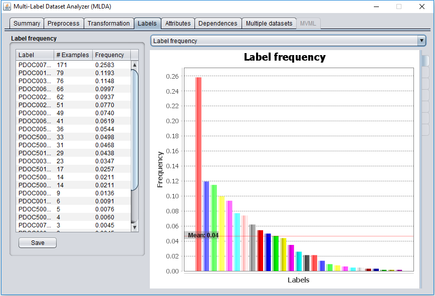

# MLDA - Multi-Label Dataset Analyzer 

MLDA is a tool for data exploration and analysis of multi-label and multi-view multi-label datasets. It includes both a GUI tool and a Java API.
It provides an easy to use tool for multi-label datasets analysis, including a wide set of characterization metrics, charts for measuring the imbalance and relationship among labels, several methods for data preprocessing and transformation, multi-view multi-label datasets characterization and allowing to load several datasets simultaneously.
It has been created under the [GPLv3 license](https://www.gnu.org/licenses/gpl-3.0.en.html) [\[License file\]](https://github.com/i02momuj/MLDA/blob/master/LICENSE).

Last release, version 1.2.4 is available [here](https://github.com/i02momuj/MLDA/releases/tag/1.2.4).
The documentation in pdf is available [here](https://github.com/i02momuj/MLDA/blob/master/doc/MLDA_Doc.pdf).
Javadoc is also available for [GUI tool](https://github.com/i02momuj/MLDA/tree/master/MLDA%20GUI/javadoc) and [API](https://github.com/i02momuj/MLDA/tree/master/API/MLDA_API/javadoc).

Please, cite this work using the *citation.bib* file or the following reference:

J.M. Moyano, E. Gibaja and S. Ventura. MLDA: A tool for analyzing multi-label datasets. Knowledge-Based Systems (2017). http://dx.doi.org/10.1016/j.knosys.2017.01.018.

